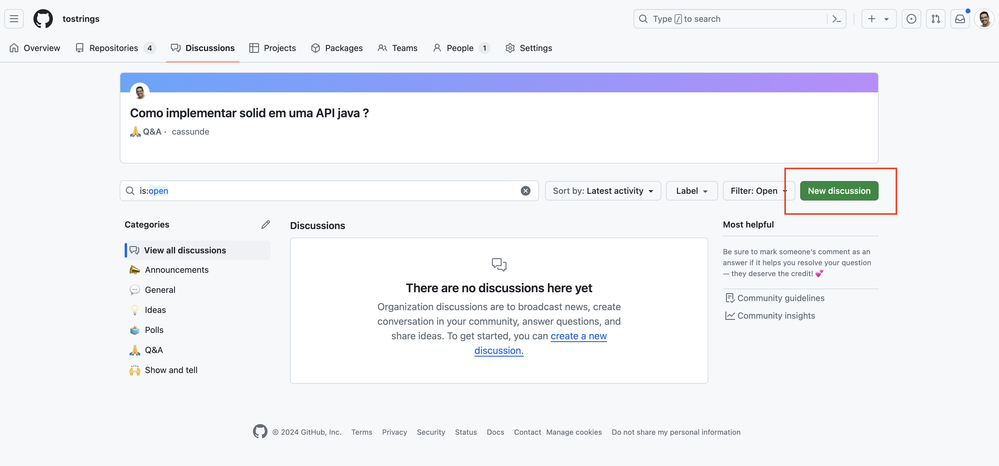
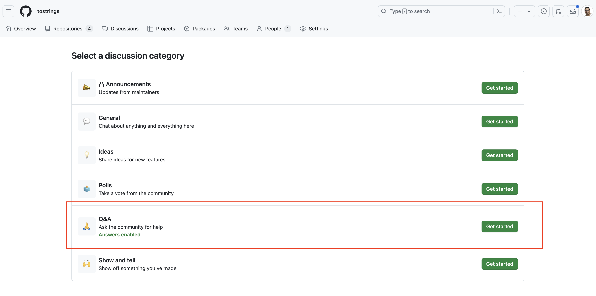
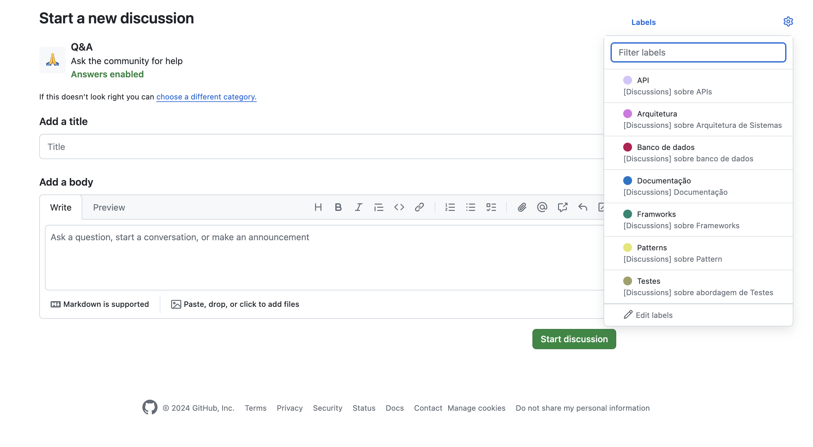

# Discussions

Se você curte a pegada de fórum, nesta organização, habilitamos as discussions, aqui você pode postar suas dúvidas sobre Java, Banco de dados e muito mais. A ideia é ser um espaço super informal e opcional para discutir alguns temas sempre no estilo Q&A.

Além disso, essa é uma ótima maneira de deixar os assuntos mais organizados e fáceis de encontrar. Uma das vantagens é que todos podemos pesquisar e aprender sobre vários tópicos juntos. É uma excelente oportunidade para trocar experiências e se ajudar, bem no estilo dos fóruns, se isso te interessa, entra na nossa organização e participa quando quiser!

---
## Como criar uma discussion
Para criar uma discussion é bem simples, veja nos passos abaixo:

1. Clique em `new discussion` como na imagem abaixo.

---
2. Clique em Q&A;

---
3. Informe sua dúvida.

Aqui você vai informar um título breve sobre sua dúvida e um texto explicando sua dúvida.

